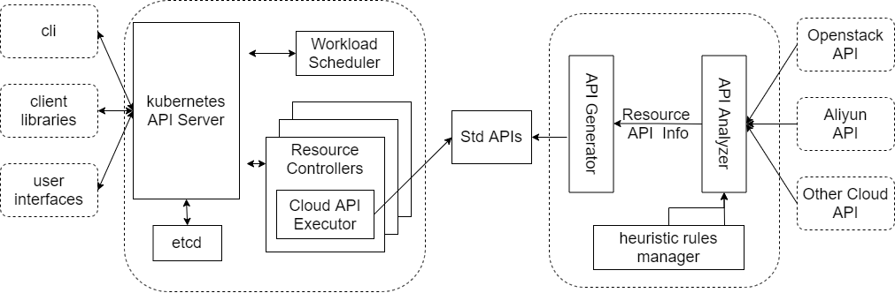

# Design
## Architecture
This Project mainly contains two submodules, the `SDK Analyzer` and the `Code Generator`. `SDK Analyzer` will 
staticly analyze the cloud sdk code's syntax tree or dynamically parse the details of cloud api or golang defined 
struct by reflection. The Information parsed from `SDK Analyzer` is used in `Code Generator`, wich will generate 
the `STD API Code`,`API Registry Code` and `JAVA SDK Code`.


### SDK Analyzer
#### Module Analyzer
The `Module Analyzer` is implemented in [module_analyzer.go](https://github.com/kube-stack/multicloud_service/blob/main/src/analyzer/module_analyzer.go), it will analyze the sdk's source code(openstack) staticly. By using the `golang/ast` package, we can get syntax tree of the cloud sdk package. Function `DoAnalyze` will scan the syntax tree and then parse the resource info we need to generate api code. Here is the definition of OpenstackResourceInfo.

```go
type OpenstackResourceInfo struct {
	ResourcePackageName string //package name
	ResourceName        string //resouce name of the request file
	ResourcePath        string //dir to save the resource Code
	ActionInfos         []*OpenStackActionInfo // actions like create, delete, update and get
	RequestImportPaths  utils.Set //import path of the request code file
	ResultImportPaths   utils.Set //import path of the result code file
}
```
#### API Analyzer
`API Analyzer` will extract Cloud API information by reflection. In cloud SDK, there will always be a `client` class, and it will implement a method for each `Std API`. Therefore, this module can parse all those methods information(method name, parameters' name and type, returns' name and type), and use those information to generate API registry and document.

```go
type CloudAPIAnalyzer struct {
	MethodMap  map[string]reflect.Method //API Name → method
	RequestMap map[string]reflect.Type   //API Name → request type
}
```

### Code Generator
#### API Code Generator
This module is implemented in [GenAPICode](https://github.com/kube-stack/multicloud_service/blob/e2c20ad1dcf4b8a65a18b37c4f71afd749c04d8f/src/code_generator/gen/cloud_code_gen.go#L56), it use `Module Analyzer` to get the API information of the cloud(openstack), then generate Std-API by templates.

#### Registry Code Generator
This moudle is implemented in [GenRegistryCode](https://github.com/kube-stack/multicloud_service/blob/e2c20ad1dcf4b8a65a18b37c4f71afd749c04d8f/src/code_generator/gen/cloud_code_gen.go#L37), the registry is a hash map of the API name and API function. With the help of registry, user can easily call the multicloud service with a json file.

#### JAVA-SDK Code Generator
We offer a [java-sdk](https://github.com/kube-stack/java-sdk) to manage the cloud service by kubernetes. In order to reduce the amount of development work, we use templates to generate java code. Developers only need to modify a few syntax errors and write test cases based on official documentation to test the `Std-API`.

### Code Templates
In this project, we generate code by using the package[`text/template`](https://pkg.go.dev/text/template), which 
implements data-driven templates for tenerating textual output. All the templates used in this project can be find 
from [src/code_generator_templates](https://github.com/kube-stack/multicloud_service/tree/main/src/code_generator/templates)
